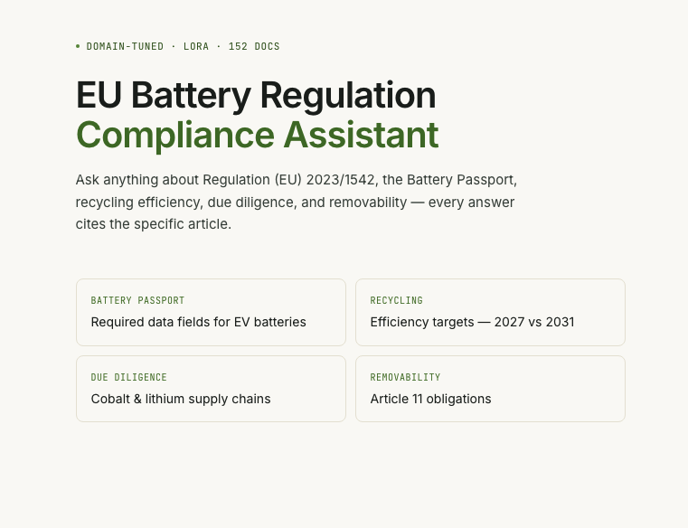

# EU Battery Regulation LLM


**A fine-tuned Mistral 7B model with RAG pipeline for answering questions about EU Battery Regulation, ECE R100, UN 38.3, and related standards — runs fully locally, no API key required.**



---

## Why This Project Exists

EU Battery Regulation (2023/1542) and its surrounding standards — ECE R100, ECE R155, UN 38.3, Battery Passport requirements — are dense, cross-referenced, and frequently amended. Practitioners in automotive, energy storage, and compliance roles spend significant time manually searching articles, annexes, and amendment texts.

This project fine-tunes a 7B model on regulatory Q&A pairs so it learns the domain's vocabulary, citation style, and reasoning patterns — then augments it with a retrieval pipeline that grounds every answer in the actual source documents. The result: an expert assistant that scores **4.36 / 5.00** on a blind 7-question evaluation, within range of frontier closed models.

---

## 🏠 Why Run Locally Instead of Claude / ChatGPT / Gemini?

Cloud LLMs like Claude, ChatGPT, and Gemini score higher in general benchmarks — but for this specific use case, a local model is often the right choice:

| | This project | Cloud LLMs |
|---|---|---|
| **Privacy** | Documents never leave your machine | Queries sent to third-party servers |
| **Cost** | Free after download | API fees add up at scale |
| **Offline** | Works without internet | Requires connectivity |
| **Domain accuracy** | Fine-tuned on EU regulatory corpus | General-purpose, no domain FT |
| **Citations** | Every sentence cites article + heading | Varies, often omitted |
| **Hallucination guard** | RAG grounds answers in source text | No document grounding by default |

If you handle confidential product data, internal compliance reviews, or work in air-gapped environments — running locally is not just convenient, it's necessary.

---

## 🏗️ Architecture

```
User Query
    │
    ▼
┌─────────────────────────────────────────────────────────┐
│                     FastAPI Backend                      │
│                                                          │
│  Query → BAAI/bge-base-en-v1.5 Embedding                │
│       → FAISS Index (EU regulatory corpus, 807 chunks)   │
│       → Top-20 candidate chunks                          │
│       → CrossEncoder Reranker → Top-5 chunks             │
│       → Context Assembly + Citation Tags                 │
│       → Mistral 7B LoRA Q8 (llama-cpp-python)           │
│       → Answer with *(Source, Heading)* citations        │
└─────────────────────────────────────────────────────────┘
    │
    ▼
Chat UI at http://localhost:7860
```

### Component Breakdown

| Component | Detail |
|---|---|
| Base Model | Mistral 7B Instruct v0.3 |
| Fine-tuning | LoRA (r=16, alpha=32, target: q_proj / v_proj) |
| Quantization | Q8 GGUF — 7.2 GB, no quality loss vs FP16 |
| Embedding | BAAI/bge-base-en-v1.5 (768-dim, EN-optimized) |
| Vector Store | FAISS IndexFlatIP, 807 regulatory chunks |
| Reranker | cross-encoder/ms-marco-MiniLM-L-6-v2 |
| Retrieval | Top-20 FAISS → Top-5 after reranking |
| Inference | llama-cpp-python (Metal on Apple Silicon / CUDA on NVIDIA) |
| Backend | FastAPI + uvicorn |
| Frontend | Custom HTML/JS chat UI |

### How It Works

1. **LoRA fine-tuning** teaches the model EU regulatory jargon, article numbering conventions, and citation style from 2,593 synthetic Q&A pairs.
2. **RAG pipeline** retrieves the most relevant chunks from the regulatory corpus at inference time — the model never relies on memorized facts alone.
3. **CrossEncoder reranking** re-scores retrieved chunks with a dedicated relevance model before injecting them into the prompt.
4. **Every answer sentence** carries a `*(Source, Heading)*` citation so the user can verify the claim in the original document.

---

## 📊 Evaluation Results

Blind evaluation on 7 unseen regulatory questions across 5 metrics (accuracy, jargon, hallucination, citation quality, trust). Scored 1–5 scale.

| Model | Score / 5.00 | Notes |
|---|---|---|
| Claude Opus 4.7 | 4.90 | Closed, general-purpose |
| Gemini Pro 3.1 | 4.72 | Closed, general-purpose |
| ChatGPT 5.5 | 4.64 | Closed, general-purpose |
| **Mistral 7B LoRA Q8 + RAG v3** | **4.36** | **This project — local, free** |
| Mistral 7B LoRA Q8 (no RAG) | 1.93 | Shows RAG impact |
| Mistral 7B Base Q4 | 1.32 | No fine-tuning, no RAG |

**Key takeaway:** RAG lifts a 7B local model from 1.93 → 4.36, closing ~85% of the gap to frontier closed models — while running entirely on your own hardware with no data leaving your machine.

---

## 📋 Covered Regulations

All source documents are **publicly available EU/UN publications**, free of charge:

| Document | Source |
|---|---|
| EU 2023/1542 — EU Battery Regulation | [EUR-Lex](https://eur-lex.europa.eu) |
| EU 2025/R1561, R0606, D0934 — 2025 amendments | [EUR-Lex](https://eur-lex.europa.eu) |
| ECE R100 Part II — EV / REESS Safety | [UNECE](https://unece.org) |
| ECE R155 — Cybersecurity Management | [UNECE](https://unece.org) |
| UN 38.3 — Lithium Battery Transport Testing | [UN](https://unece.org) |
| Battery Passport specification | [Battery Pass Consortium](https://batterypass.eu) |

The RAG index (807 chunks) is prebuilt and downloaded automatically. You do not need the original PDFs to run the app.

---

## 🚀 Quick Start

### Requirements

- Python 3.10+
- **8 GB+ VRAM** (Apple Silicon M-series or NVIDIA GPU)
- 10 GB free disk space
- Git

> **VRAM note:** The Q8 GGUF model is 7.2 GB. Apple M-series uses unified memory — 16 GB RAM recommended. On NVIDIA, RTX 3080 / A10 or equivalent (8 GB+ VRAM) works with the llama-cpp-python CUDA build.

### Installation & Run

```bash
git clone https://github.com/birol91/eu-battery-regulation-llm
cd eu-battery-regulation-llm
pip install -r requirements.txt
python app.py
```

Open [http://localhost:7860](http://localhost:7860) in your browser.

**First launch** automatically downloads from HuggingFace (~8 GB total):
- Q8 GGUF model weights (7.2 GB)
- Prebuilt FAISS index + regulatory corpus chunks (0.5 GB)

Subsequent launches load from local cache instantly.

### Environment Variables (optional)

| Variable | Default | Description |
|---|---|---|
| `HF_TOKEN` | — | Only needed if repo is private |
| `PORT` | `7860` | Server port |
| `N_GPU_LAYERS` | `-1` | GPU layers (`-1` = all on GPU) |

---

## 📁 Repository Structure

```
eu-battery-regulation-llm/
├── app.py              # FastAPI backend — entry point
├── src/
│   └── retriever.py    # FAISS + CrossEncoder RAG retriever
├── index.html          # Chat UI
├── requirements.txt
└── README.md
```

Model weights and RAG index are hosted on HuggingFace (downloaded automatically on first run).

---

## 🤗 HuggingFace

Model weights and prebuilt RAG index:

**[huggingface.co/birol91/eu-battery-regulation-llm](https://huggingface.co/birol91/eu-battery-regulation-llm)**

- `eu-battery-mistral-q8.gguf` — production model (7.2 GB)
- `rag_index/` — prebuilt FAISS index (807 chunks, 807 regulatory passages)

---

## License

MIT — see [LICENSE](LICENSE).

Mistral 7B base model: Apache 2.0 (Mistral AI).  
Regulatory source documents: public domain EU/UN publications.
